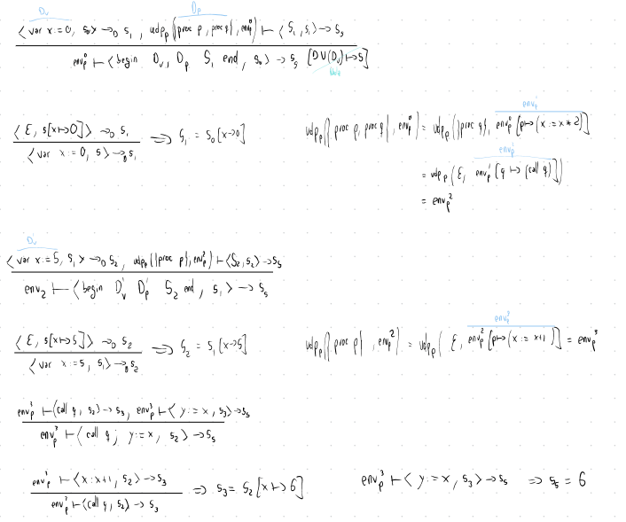

# Semántica operacional básica. Ejercicios
## Ejercicio 3.2
### Enunciado
Extender la semántica operacional de paso corto de **WHILE** con la instrucción:

    assert b before S

Demostrar la equivalencia semántica entre `assert true before S` y `S`, pero que
`assert false before S` no es equivalente a `skip` ni a `while true do skip`.

### Resolución
En primer lugar, la definición de su semántica será:
$$
\left[ \mathrm{assert}_{\mathrm{sos}} \right] := \langle \mathtt{assert}\ b\
\mathtt{before}\ S, s \rangle \Rightarrow \langle S, s \rangle, \text{ si }
\mathcal{B}\llbracket b \rrbracket = \mathbf{tt}
$$
Es decir, solo está definido para el caso en que la condición se cumpla. En
cualquier otro, simplemente tenemos *undefined*.

Veamos ahora la equivalencia. Claramente, $\langle \mathtt{assert\ true}\
\mathtt{before}\ S, s \rangle \Rightarrow \langle S, s \rangle$ con lo que es
equivalente a $S$.

Veamos ahora las *no* equivalencias. Por la propia definición, para $\langle
\mathtt{assert\ false\ before}\ S, s \rangle$ no existe ninguna derivación que se le
pueda aplicar. Sin embargo, $\langle \mathtt{skip}, s \rangle \Rightarrow s$ y
$\langle \mathtt{while\ true\ do}\ S, s \rangle \Rightarrow \langle \mathtt{if}\ \mathtt{true}\ \mathtt{then}\ \left( S\ \mathtt{;}\ \mathtt{while}\ \mathtt{true}\ \mathtt{do}\ S\ \right)\ \mathtt{else}\ \mathtt{skip}, s \rangle \Rightarrow \langle S\ \mathtt{;}\ \mathtt{while}\ \mathtt{true}\ \mathtt{do}\ S\, s \rangle$ con lo que es un bucle infinito, pero está definido en todo paso.

## Ejercicio 3.9
### Enunciado
Usar semántica para asegurar que el resultado de $y$ tras ejecutar el siguiente
programa es $6$ usando entornos dinámicos.
```
begin var x := 0;
      proc p is x := x * 2;
      proc q is call p;
      begin var x := 5;
            proc p is x := x + 1;
            call q;
            y := x;
      end
end
```

### Resolución
Simplemente tenemos que ir aplicando las reglas de derivación que correspondan:


## Ejercicio 3.14
### Enunciado
Demostrar la equivalencia entre la semántica de **While** dada por direcciones
de memoria y la dada originalmente con la función estado.

### Resolución
En primer lugar, si $s \in \textbf{State}$ la relación que tendrá con el estado
dado por *store*s y entornos de variables vendrá dada por la composición de
estos, $s = sto \circ env_V$. Por tanto, lo que tratamos de ver es que
$\langle S, s \rangle \rightarrow s' \Leftrightarrow env_V, env_P \vdash \langle
S, sto \rangle \rightarrow sto'$. Las reglas de derivación con el símbolo «$'$»
se referirán a las relacionadas con direcciones de memoria. Razonaremos por
inducción estructural.

- Asignaciones:
    $$
    \left[ \mathrm{ass} \right] := \langle x := a, s \rangle
    \rightarrow s\left[ x \mapsto \mathcal{A}\llbracket a \rrbracket s \right] =
    s'
    $$
    $$
    \left[ \mathrm{ass}' \right] := env_V, env_P \vdash \langle x
    := a, sto \rangle \rightarrow sto\left[ l \mapsto v \right] = sto'
    $$
    donde $l = env_V\ x$ y $v = \mathcal{A}\llbracket a \rrbracket
    \underbrace{sto \circ env_V}_{s}$. Por tanto,
    $$
    (sto' \circ env_V) y = \begin{cases}
        s\ y, &\text{si } y \neq x\\
        \mathcal{A}\llbracket a \rrbracket s, &\text{si } y = x
    \end{cases}
    $$
    que es lo mismo a $s'$, por lo que son equivalentes.

- *Skip*, trivial.

- Composición:
    Supongamos que $s = sto \circ env_V$. Aplicando $\left[ \mathrm{comp} \right]$ tenemos que se cumple $\langle S, s \rangle \rightarrow s'$ y $\langle S, s' \rangle \rightarrow s''$ y, aplicando la hipótesis de inducción, $sto' \circ env_V = s'$ y $sto'' \circ env_V = s''$ y se cumplen $env_V, env_P \vdash \langle S, sto \rangle \rightarrow sto''$ y $env_V, env_P \vdash \langle S, sto \rangle \rightarrow sto''$. Con esto podemos aplicar $\left[ \mathrm{comp}' \right]$ y tenemos el resultado.

- Condicional:
    Supongamos que la condición es (o no) cierta y que $s = sto \circ env_V$.
    Aplicando $\left[ \mathrm{if}^{\mathrm{tt}} \right]$ tenemos que $\langle
    S_1, s \rangle \rightarrow s'$ sobre el cuál podemos aplicar la hipótesis de
    inducción y obtener $env_V, env_P \vdash \langle S_1, sto \rangle
    \rightarrow sto'$ además de $s' = sto' \circ env_V$. Como $s = sto \circ
    env_V$, es seguro que $\mathcal{B}\llbracket b \rrbracket = \mathbf{tt}$ y
    podemos aplicar $\left[ \mathrm{if}^{\mathrm{tt}'} \right]$ con lo que
    obtenemos el resultado buscado.

- Bucle: Similar al condicional.

Todos los recíprocos salen simplemente al invertir los pasos.

## Ejercicio 3.15
### Enunciado
Modificar la semántica sobre los procedimientos para que ahora acepten dos
parámetros con paso por valor.

### Resolución
La mayoría de las reglas se mantienen sin ninguna variación. Tenemos que
cambiar:
- Declaración de bloques:
    Tenemos que cambiar la actualización del entorno de procedimientos:
    - Caso base:
    $$
    \mathrm{udp}_P\left( \varepsilon, env_V, env_P \right) = env_P
    $$
    - Caso recursivo:
    $$
    \begin{gather*}
    \mathrm{udp}_P\left( \mathtt{proc}\ p\left( x_1, x_2 \right)\ \mathtt{is}\ S; D_P, env_V,
    env_P \right) =\\ \mathrm{udp}_P\left( D_P, env_V, env_P\left[ p \mapsto
    \left( x_1, x_2, S, env_V\left[ x_1 \mapsto \mathrm{next}, x_2 \mapsto \mathrm{next} \right], env_P \right) \right] \right)
    \end{gather*}
    $$

- Llamadas:
    - No recursivas:
    $$
    \begin{align*}
    \left[ \mathrm{call}_{\mathrm{ns}} \right] &:= \frac{
    \begin{aligned}
        env'_V, env_P' \vdash \langle S, sto[ sto \circ env_V\  x_1 &\mapsto \mathcal{A}\llbracket a_1 \rrbracket sto \circ env_V,\\
        sto \circ env_V\  x_2 &\mapsto \mathcal{A}\llbracket a_2 \rrbracket sto \circ env_V] \rangle \rightarrow sto'
    \end{aligned}
    }{env_V, env_P \vdash \langle \mathtt{call}\ p(a_1, a_2), sto \rangle \rightarrow sto'},\\
    &\text{si } env_P\ p = \left( a_1, a_2, S, env'_V, env'_P \right)
    \end{align*}
    $$
    - Recursivas:
        Serán similares a las no recursivas con la excepción de que el entorno
        de procedimientos de la hipótesis será:
        $$
        env_P'\left[ p \mapsto \left( x_1, x_2, S, env'_V, env'_P \right) \right]
        $$
